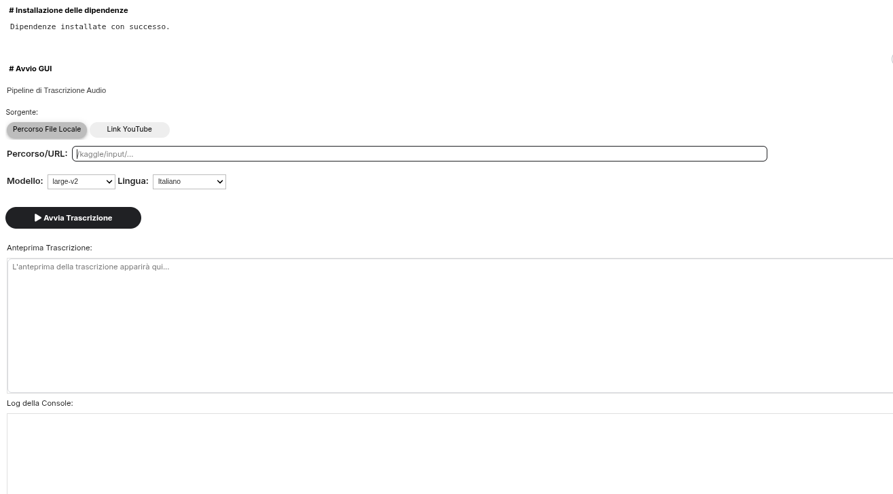

# Faster Whisper Transcription Pipeline

A robust, GPU-accelerated audio transcription pipeline with an interactive GUI, built for Google Colab and Kaggle.

## Overview

This repository provides an end-to-end audio transcription pipeline utilizing `faster-whisper`. It features advanced audio preprocessing via FFmpeg (silence removal and normalization), integrated spell-checking for post-processing, and native support for downloading audio directly from YouTube.

The project includes both a lightweight widget-based GUI (Graphical User Interface) for interactive cloud notebook environments and a headless script version for automated workflows.

## Supported Languages

* **Italian**
* **English**

## Repository Structure

The repository is organized as follows:

    ├── images/                              # Images for documentation
    ├── notebooks/
    │   ├── faster_whisper_gui_colab.ipynb   # Interactive GUI version for Google Colab
    │   ├── faster_whisper_gui_kaggle.ipynb  # Interactive GUI version for Kaggle
    │   └── faster_whisper_no_gui.ipynb      # Headless/CLI version for automated processing
    ├── SDDs/                                # Software Design Documents
    └── README.md

## Technical Details

### Preprocessing Pipeline

To maximize transcription accuracy, the input audio undergoes several FFmpeg filters before being fed to the model:

* **Format Conversion:** Converted to 16kHz `pcm_s16le` WAV format.
* **`silenceremove`:** Trims extended silence at the start and end of the audio.
* **`loudnorm` / `speechnorm`:** Normalizes the audio volume to ensure consistent input levels for the Whisper model.

### Transcription

The transcription step utilizes `BatchedInferencePipeline` from `faster-whisper`, processing chunks of audio concurrently (default batch size: 16) with Voice Activity Detection (VAD) filtering enabled.

### Postprocessing

After the audio is transcribed, the generated text segments go through a refinement stage to improve readability and correctness:

* **Character Cleaning:** Non-ASCII characters are stripped from the output. Custom logic is included to ensure that necessary special characters specific to the target language (such as accented vowels in Italian like *à, è, é, ì, í, ò, ó, ù, ú*) are preserved while unwanted artifacts are removed.
* **Spell Correction:** Each clean text segment is processed through the lightweight `autocorrect` library (e.g., `Speller(lang='it')` for Italian) to catch and fix common misspellings dynamically.

## Currently Working On

* Postprocessing with lightweight LLMs to further enhance the results.
* Local executable with CPU-only inference support.

## Consulted References

* [A Comparative Study of Speech-to-Text for Italian](https://ceur-ws.org/Vol-4121/Ital-IA_2025_paper_33.pdf)
* [Enhancing Whisper transcriptions: pre- & post-processing techniques (article)](https://developers.openai.com/cookbook/examples/whisper_processing_guide)
* [Enhancing Whisper transcriptions: pre- & post-processing techniques (notebook)](https://github.com/Azure-Samples/openai/blob/main/Basic_Samples/Whisper/dotnet/csharp/Whisper_processing_guide.ipynb)
* [Audio Pre-Processings For Better Results in the Transcription Pipeline](https://medium.com/@developerjo0517/audio-pre-processings-for-better-results-in-the-transcription-pipeline-bab1e8f63334)
* [`faster-whisper` Repository](https://github.com/SYSTRAN/faster-whisper)
* [Batched Whisper Blog](https://mobiusml.github.io/batched_whisper_blog/)
* [WhisperHallu Repository](https://github.com/EtienneAb3d/WhisperHallu)
